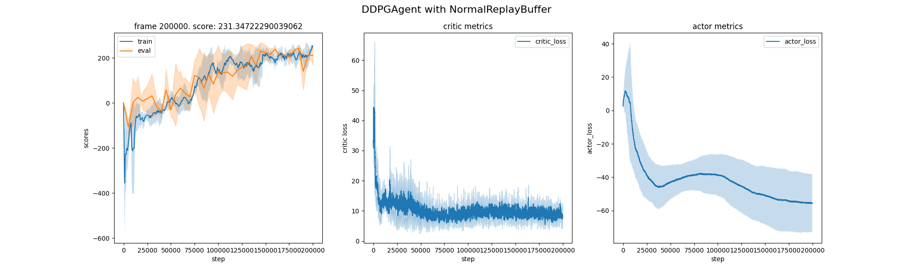
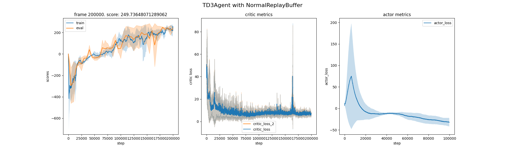
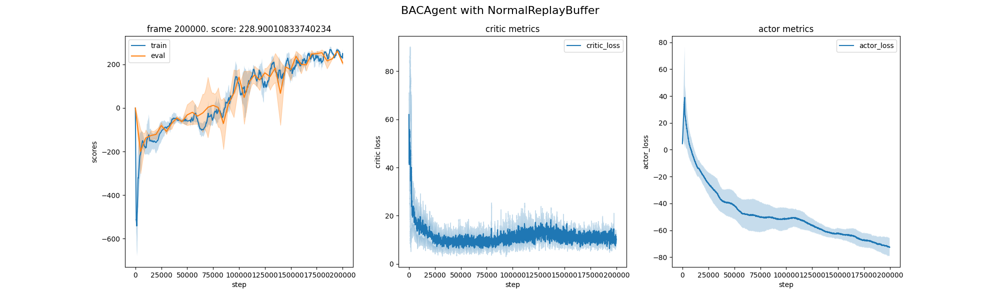
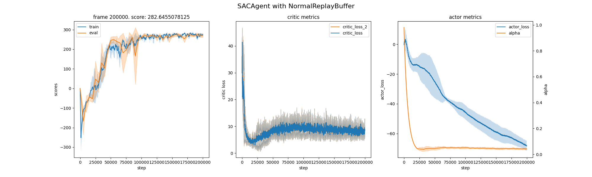

# off-policy-RL
Implemented several off-policy RL algorithms with continuous action space.
Use LunarLander as the default environment.






## implemented RL algorithms:
- Deep Deterministic Policy Gradient (DDPG)
- Twin Delayed DDPG (TD3)
- Batch Actor Critic (BAC)
- Soft Actor Critic (SAC)

## Installation
1. Prepare Python environment, Python 3.10 is recommended
```
conda create -n rl310 python=3.10
conda activate rl310
```
2. Prepare Pytorch module
```
pip install torch==2.2.1 torchvision==0.17.1 torchaudio==2.2.1 --index-url https://download.pytorch.org/whl/cu118
```
3. Prepare project-dependent packages
```
pip install gymnasium[toy_text]==0.29.1
pip install gymnasium[classic_control]==0.29.1
pip install gymnasium[box2d]==0.29.1
pip install hydra-core==1.3.2
pip install moviepy==1.0.3
pip install matplotlib, dotmap, tabulate
pip install swig
pip install jaxtyping, beartype
```

## Quick Start
```
cd off_policy_RL
python main.py agent=ddpg # sequential seed training
python main_mp.py agent=ddpg # multiprocessing seed training
```
Training logs can be found in the `off_policy-RL/runs` folder
